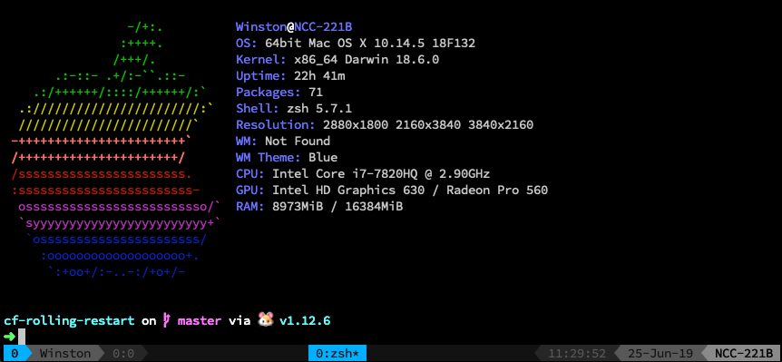

# dotfiles
My personal dotfiles which will eventually target OS X, Linux, and WSL.

## Installation

**On OS X:**  
`curl -fsSL https://raw.githubusercontent.com/WRMilling/dotfiles/master/.scripts/setupMac.sh | sh -`

**On Linux/WSL:**  
First download the setup script (this can be deleted later).

`wget https://raw.githubusercontent.com/WRMilling/dotfiles/master/.scripts/setupLinux.sh`

Ensure it is executable:

`chmod u+x setupLinux.sh`

and execute: 

`./setupLinux.sh`

